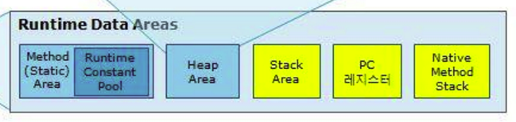

- [직렬화(Serialization), 역직렬화(Deserialization)](#직렬화serialization-역직렬화deserialization)
- [JVM](#jvm)
- [Garbage Collection](#garbage-collection)
- [Java Multi-Thread](#java-multi-thread)
- [Blocking vs Non-blocking (sync/async)](#blocking-vs-non-blocking-syncasync)

---

### 직렬화(Serialization), 역직렬화(Deserialization)

> 💁🏻 : 직렬화는 객체를 데이터스트림으로 만드는 것을 의미하고 역직렬화는 데이터스트림을 읽어 객체로 만드는 것을 의미한다.

자바는 입출력할 때 스트림이라는 데이터 통로를 통해 이동한다. 하지만 객체는 스트림을 통해 저장하거나 네트워크로 전송하는 것이 불가하다. 따라서 객체를 스트림으로 입출력하기 위해 바이트 배열로 변환하는 과정이 필요하다.

참고로 찾은 레퍼런스에 따르면 직렬화가 필요한 예시로 - 서버가 다중화되어있고 세션 클러스터링을 통해 세션관리를 하는 환경에서 도메인 객체가 세션에 저장이 될 때 도메인 객체에 Serializable 인터페이스를 구현해야 정상적으로 세션에 저장하고 꺼내올 수 있다고 한다. 도메인 객체가 세션에 저장하지 않는 단순한 데이터 집합이고 컨트롤러에서 생성되어 뷰에서 소멸되는 데이터의 전달체라면 객체의 직렬화는 고려하지 않아도 된다고 한다.

직렬화를 할 때는 `serialVersionUID` 값을 지정해주는 것을 권장한다. 별도로 지정하지 않을 경우 컴파일할 때 자동으로 생성된다. 이 값을 설정해주는 이유는 서버 to 서버로 객체를 전달할 때 서버가 쉽게 올바른 객체인지를 판단할 수 있기 때문이다.

예를 들어 A 서버에서 B 서버로 전달하는 DTO 클래스가 있다고 가정해보면, 두 서버에는 DTO 클래스가 존재해야한다. 하지만 만약 A 서버의 DTO 클래스에 변수가 3개있고 B 서버에는 변수가 4개있을 경우 Java에서는 제대로 처리할 수 없기 때문에 버전을 관리해주어야 한다. 즉, 클래스 이름이 같더라도 이 값이 다르면 다른 클래스로 인식한다. (물론 같은 값이더라도 변수의 개수나 타입이 다르면 다른 클래스로 인식한다.)

직렬화의 방법에는 CSV, JSON, XML 등 다양한 포맷이 존재한다. 스프링 프레임워크에서는 데이터를 전달받는 형태가 JSON인 경우 Jackson에서 ObjectMapper로 직렬화를 수행한다.

결론적으로는 객체를 다른 환경에서도 사용할 수 있게 전달하고 전달받기 위해 사용하는 것이 직렬화다.

### JVM

> 💁🏻 : JVM은 Java를 실행하기 위한 가상 머신이다. Java로 작성된 코드는 JVM이 인식할 수 있는 기계어인 바이트 코드로 변환되고 JVM이 운영체제가 이해할 수 있도록 바이트 코드를 해석해주는 구조로 동작한다.

**전체적인 동작 흐름**

Java로 작성한 코드는 Java Compiler에 의해 바이트 코드로 변환이 되고 변환된 파일은 JVM에 의해 운영체제가 이해할 수 있는 기계어로 만들어 실행된다.

**Class Loader**

Java Compiler로 변환된 바이트 코드는 Class Loader에 의해 읽혀진다. Java 클래스들은 구동시 한번에 로드되지 않고 애플리케이션에 의해 필요할 때 로드되는데, Class Loader는 이를 런타임에 동적으로 JVM에 로드시킨다. 결론적으로 Class Loader를 통해 바이트 코드를 읽고 JVM의 실행 엔진이 사용할 수 있도록 Runtime Data Areas의 영역에 적재해주는 역할을 수행한다.

Class Loader에서는 또 다시 로딩/링킹/초기화 3가지의 과정을 거치게 된다.

로딩은 클래스 파일을 읽고 바이너리 코드로 만들어 메모리에 저장하는 과정을 수행한다. 로딩이 완료된 이후에는 해당 클래스 타입의 객체를 생성하여 Heap 영역에 저장한다. 로딩할 때는 정해진 순서에 따라 클래스를 로딩하는데 이를 위임 모델이라고 한다.

링킹 과정은 코드 내부의 레퍼런스를 연결하는 과정을 의미한다. 클래스 파일이 유효한지 확인하고 클래스 파일에 맞는 데이터 구조를 준비한 후 레퍼런스를 연결하는 과정이라보면 된다.

마지막으로 초기화 과정은 `static` 변수를 초기화하고 값을 할당하는 과정이다.

**Runtime Data Areas**

Runtime Data Areas는 Class Loader가 바이트 코드를 읽어 적재해두는 영역이다. 메모리 영역은 크게 5개로 나뉜다.

Method Area는 클래스 정보를 처음 메모리 공간에 올릴 때 초기화되는 대상을 저장하기 위한 메모리 공간이다. Runtime Constant Pool이 존재하는 영역으로서 `static` 영역으로 상수 자료형을 저장하고 참조하고 중복을 막는 역할을 수행한다.

Heap 영역은 `new` 키워드로 생성된 객체와 같이 긴 생명주기를 가지는 데이터들이 저장되는 공간이다.

Stack 영역은 Heap 영역에 있는 객체들을 가르키는 레퍼런스 변수들이 올라가는 공간이다. 즉, 프로그램 실행과정에서 임시로 할당되었다가 메서드 호출이 정상적으로 완료되거나, 예외가 던져지거나, 쓰레드가 종료될 때 바로 소멸되는 특성의 데이터를 저장하기 위한 영역이다.

PC Register 영역은 쓰레드가 생성될 때마다 해당 쓰레드가 어떤 명령을 실행할지에 대한 내용을 기록하는 공간이다. 각 쓰레드마다 하나씩 존재하며 현재 수행중인 JVM 명령의 주소를 가진다.

Native Method Stack 영역은 C, C++, 어셈블리어로 구축한 네이트브한 코드들이 담겨있는 공간이다. 즉, Java가 아닌 다른 언어로 작성된 코드를 지원하기 위해 사용되는 영역이다.

**Execution Engine**

실행 엔진은 Class Loader가 Runtime Data Areas에 배치한 바이트 코드를 실행해주는 역할을 수행한다. 위에서 말했듯, 바이트 코드를 내부에서 기계가 실행할 수 있는 형태로 변경해주는 역할을 수행한다.

실행 엔진에는 Interpreter, JIT Compiler, GC 3가지가 존재한다.

Interpreter는 바이트 코드를 명령어 단위로 읽어서 실행한다. 한 줄씩 해석하기 때문에 느리다는 단점을 지니고 있다.

JIT Compiler는 Just-In-Time의 약자로 프로그램을 실행하는 시점에 기계어로 변환하는 컴파일러다. Interpreter에 의해 지속적으로 변환 작업이 수행되지만 필요한 코드의 정보는 캐시에 담아두었다가 재사용하는 개념이다.

(GC에 대한 내용은 Heap 영역과 긴밀한 관계를 가지고 있기에 내용이 많아 별도로 정리해두었다.)

### Garbage Collection

> 💁🏻 : GC는 메모리를 해제시켜주는 역할을 수행한다. JVM의 Heap 영역 내부에는 Young, Old Generation으로 나뉘어지는데 해당 영역들에서 GC가 발생했을 때를 Minor GC, Major(Full) GC라고 지칭한다. Young Generation은 새롭게 생성한 객체들이 위치하는 공간이고 Old Generation은 Minor GC를 수행했음에도 살아남은 객체들이 모이는 공간이다.

GC을 알아야하는 이유는 JVM이 애플리케이션 실행을 멈추는 stop-the-world 현상 때문이다. 이 현상이 발생하게되면 GC를 실행하는 쓰레드를 제외한 모든 쓰레드가 작업을 멈춘다. 따라서 stop-the-world가 발생하면 중단되는 작업이 애플리케이션 운영에도 영향을 미칠 수 있어 이 현상의 시간을 줄이기 위한 GC 튜닝작업을 해야한다.

GC 튜닝 작업을 하기 위해서는 GC가 어떻게 동작하는지와 어떤 기준으로 메모리를 해제를 하는지에 대한 내용은 알고 있어야한다.

**Root Set**

많은 객체는 여러 다른 객체를 참조하고 참조된 다른 객체들도 또 다른 객체들을 참조하는 참조 사슬을 이룬다. 따라서 유효한 참조인지를 확인하기 위해서는 최초의 참조가 있어야하는데, 이를 Root Set이라고 한다.

**Reachability**

GC가 수행되는 기준은 Reachability 개념을 사용한다. 유효한 참조는 Reachable, 유효하지 않은 참조는 Unreachable로 구별되고 Unreachable 객체가 GC의 대상이 된다.

**GC Reference**

GC의 Reachability를 개발자가 컨트롤할 수 있도록 Reachable한 객체는 모두 다른 접근성 수준을 가지고 있다. 즉, Java는 적절한 Reference를 이용하여 GC에 의해 제거될 데이터에 우선 순위를 적용하여 더 효율적인 메모리 관리를 하기 위해 종류를 나누어 제공한다. Strong, Soft, Weak, Phantom이 있으며 뒤로 갈 수록 GC에 의해 제거될 우선 순위가 높다.

Strong은 `java.lang.ref` 패키지를 사용하지 않은 일반적인 참조이며 Root Set과 참조 관계로 연결되어있을 경우 제거되지 않는 객체다. 보통 Strong Reference에 관련된 코드를 살펴보면 개발자가 직접 객체에 null 값을 할당하여 객체를 Unreachable 상태로 만들어 메모리에서 해제가 되도록 되어있다.

Soft는 `java.lang.ref` 패키지를 사용한 참조다. Soft 객체들은 JVM 메모리가 부족한 순간이 오는 경우에 수거하고 사용되는 빈도수가 높을 수록 어떤 참조 관계를 가지던 GC가 되지 않는다. 언뜻 보면 캐싱에 적절한 Reference 수준이라고 생각할 수 있지만, 메모리가 부족할 때마다 GC가 일어나기에 잦은 GC가 일어날 가능성이 높아 캐싱에는 올바르지 않는 Reference다.

Weak도 `java.lang.ref` 패키지를 사용한 참조다. Weak 객체들은 JVM이 해당 객체의 참조를 null로 설정하여 Unreachable로 만들기 때문에 GC가 발생했을 때 어떠한 참조 관계를 가지던 GC 대상이 된다.

Reference Queue는 Soft, Weak 객체가 참조하는 객체가 GC 대상이 되면, Soft, Weak 객체 내의 참조는 null로 설정되고 Reference Queue에 enqueue된다. 이 작업은 GC에 의해 자동으로 수행되며 이를 이용해 Reference Queue는 특정 객체가 더 이상 필요없어졌을 때 관련된 후처리를 해야하는 애플리케이션에서 유용하게 사용한다.

Phantom은 Soft, Weak와 다르게 올바르게 삭제하고 삭제 이후 작업을 조작하기 위해 사용된다. Phantom은 Reference Queue가 필수적으로 필요하다. 꽤나 어려운 내용이기에 [Phantom Reference의 동작 과정에 대한 글](https://luckydavekim.github.io/development/back-end/java/phantom-reference-in-java)을 살펴보는 편이 좋다.

**GC 동작 과정**

GC 동작 과정은 Heap 영역에서의 흐름으로 살펴보아야 한다.

1. 객체는 Eden 영역에 생성된다.
2. Eden 영역에 객체가 가득차면 GC가 발생한다. (Minor GC)
3. GC가 발생했음에도 살아남은 객체는 Survivor0으로 이동한다.
4. 3번까지의 과정이 반복되고 Eden과 Survivor0이 가득차면 GC가 일어나면서 살아남은 객체들은 Survivor1으로 이동한다.
5. 이렇게 Survivor0과 Survivor1으로 객체가 반복적으로 이동하면서 일정 시간이나 횟수 이상 살아남은 객체들은 Old 영역으로 이동한다.
6. Old 영역에서도 모든 객체를 검사하고 참조되지 않는 객체들은 GC를 통해 제거된다. (Full GC)

**GC 종류**

GC의 종류는 대표적으로 Serial, Parallel, Parallel Old, CMS, G1 GC가 있다. 각 GC에서는 사용하는 알고리즘의 동작이 모두 다르다. GC에서 사용하는 알고리즘에 대한 내용은 제외하고 GC의 종류에 대한 정리만 한다면 다음과 같다.

**Serial GC**

단 하나의 쓰레드로 동작하며 가장 오래된 GC다. stop-the-world 시간이 가장 길다. (Mark-Sweep-Compaction 알고리즘)

**Parallel GC**

여러 개의 쓰레드를 이용하기 때문에 Serial GC보다 속도 면에서는 더 우월하다. 이 GC는 메모리가 충분하고 개수가 많을 때 유리하다. (Mark-Sweep-Compaction 알고리즘)

**Parallel Old GC**

Parallel GC와는 비슷하지만 알고리즘이 Mark-Summary-Compaction을 사용한다는 점에서 차이가 있다.

**CMS GC**

Parallel GC보다 더 개선하여 stop-the-world 시간을 최소화한 GC다. 모든 애플리케이션의 응답 속도가 매우 중요할 때 사용하는 GC다. 하지만 다른 GC에 비해 CPU를 더 잡아먹고 stop-the-world 시간은 최소화되었지만 GC를 수행하는 시간이 더 오래 걸린다는 단점이 있다.

**G1 GC**

CMS GC를 대체하기 위해 등장한 GC다. 대용량 메모리가 있는 멀티 프로세스 시스템을 위해 만들어졌다. 빠른 처리 속도와 stop-the-world를 최소화한다. 성능적으로 가장 뛰어나며 Java 9 부터는 기본 GC가 되었다.

기존에 사용하는 GC와는 다르게 Young과 Old 영역을 나누지 않고 Heap의 일정한 크기의 Region이라는 논리적인 단위로 나누어서 관리한다.

### Java Multi-Thread

> 💁🏻 : 무조건 좋다고는 할 수 없지만 하나의 프로세스 내에서 메모리를 공유하기 때문에 자원의 낭비가 적고 효율적으로 작업을 처리할 수 있어 멀티 쓰레드 개발을 한다.

Java에서 멀티 쓰레드 개발을 할 때에는 주의해야한다. 우선 멀티 프로세스와 멀티 쓰레드의 차이를 먼저 알아야한다. 프로세스와 쓰레드의 가장 큰 차이는 메모리를 공유하느냐 안하느냐의 차이다.

(참고로 쓰레드는 NEW, RUNNABLE, BLOCKED, WAITING, TIME_WAITING, TERMINATED 상태가 존재한다.)

- 멀티 프로세스

- 멀티 쓰레드

만약 여러 쓰레드가 접근하는 싱글톤 객체일 경우에는 필드 변수에서 상태값을 가지고 있으면 안되며 모든 변수를 파라미터로 넘겨받고 반환하는 방식으로 코드를 구현해야한다.

보통 Java에서는 `synchronized` 키워드를 이용하여 쓰레드간 레이스 컨디션을 통제한다. 그리고 필드에 Collection이 필요할 경우에는 이 키워드를 기반으로 구현된 `Vector, HashTable` 등을 이용할 수 있다. 하지만 이 Collection들은 API가 적고 성능적으로 좋지 않다.

기본적으로는 Collections라는 util 클래스에서 제공되는 `static` 메서드를 통해 해결한다. 보다 더 좋은 성능을 발휘하기 위해서 JDK 1.7 부터는 Concurrent 패키지를 통해 더 좋은 자료구조를 제공한다.

하지만 만약 쓰레드별로 서로 다른 값을 처리해야한다면 `ThreadLocal`을 이용하면 된다. 즉, 각 쓰레드별로 가지는 고유의 값이라고 생각하면 된다. `ThreadLocal` 변수는 `private static final`로 선언해야하며 사용이 끝나면 `remove()` 메서드를 호출하는 습관을 가져야한다.

### Blocking vs Non-blocking (sync/async)

> 💁🏻 : Blocking은 일이 완료될 때까지 기다리는 것이고 Non-blocking은 일이 완료될 때까지 기다리지 않는 것을 의미한다. Sync는 동기 Async는 비동기를 의미한다.

4개의 개념은 다음과 같이 구분지을 수 있다.

- Blocking : 제어권을 넘기지 않음
- Non-blocking : 제어권을 넘김
- Sync : 결과를 돌려줄 때 결과의 순서에 관심이 있음
- Async : 결과를 돌려줄 때 결과의 순서에 관심이 없음

Blocking, Non-blocking과 Sync, Async는 혼합하여 사용할 수 있다. 우리가 흔히 말하는 동기는 Sync + Blocking이고 비동기는 Async + Non-blocking을 의미한다. Async + Blocking과 Sync + Non-blocking 조합은 드물지만 의도치 않게 발생하는 경우가 있기에 알아두어야 한다.

Async + Blocking은 호출하는 함수가 호출된 함수의 작업 결과에 관심이 없음에도 호출된 함수의 결과를 기다리고 있어야 하며, Sync + Non-blocking은 호출된 함수의 결과를 처리하는대로 반환하지만 호출하는 함수가 작업 완료 여부를 계속 신경을 쓰는 구조다.

